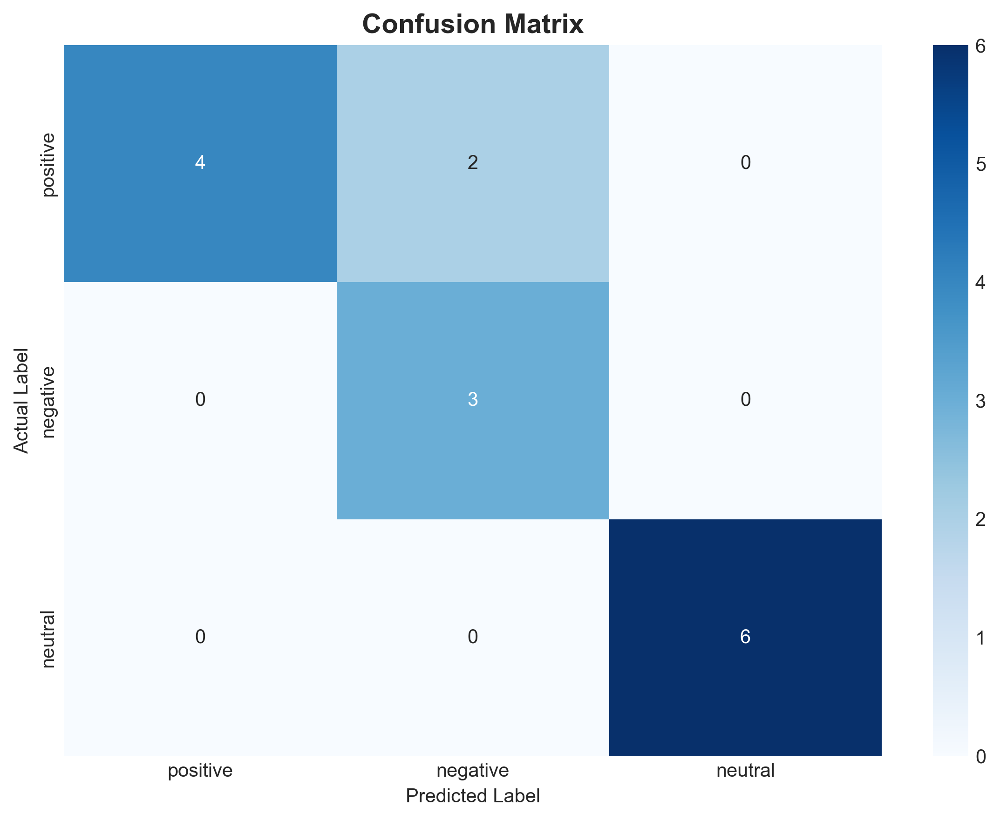
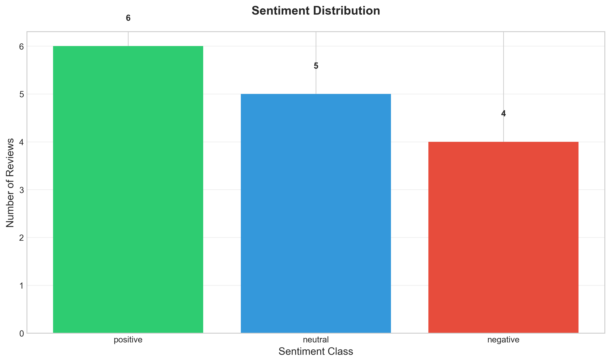
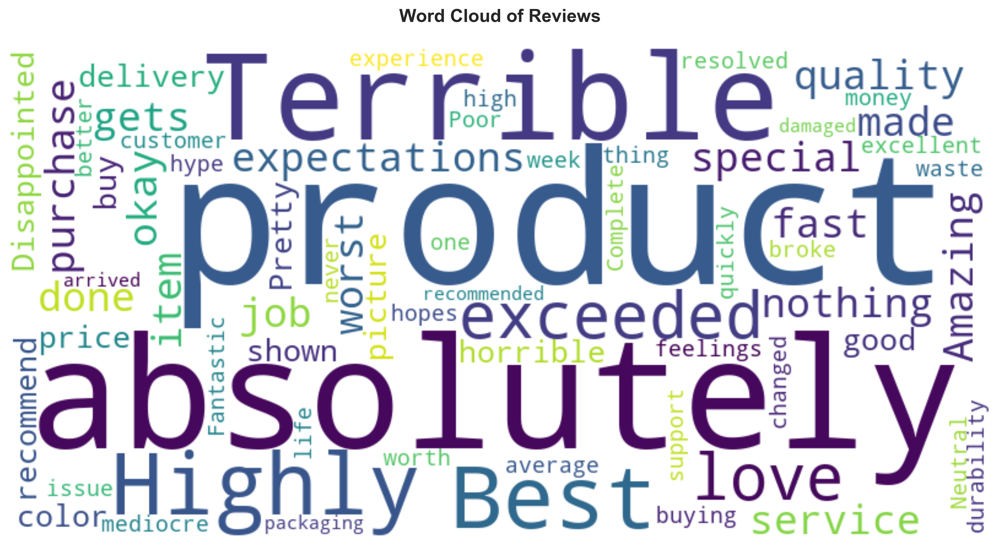

# Sentiment Analysis Pipeline

Production-ready sentiment analysis system for customer review classification using TextBlob with custom lexicon enhancement.

## Overview

This pipeline processes textual customer reviews and classifies them into positive, negative, or neutral categories. It combines NLTK for text preprocessing, TextBlob for polarity scoring, and a custom neutral-word lexicon to improve classification accuracy on ambiguous reviews.

**Key Features:**
- Automated text preprocessing (tokenization, stopword removal, lemmatization)
- Hybrid sentiment classification (TextBlob + custom lexicon)
- Model evaluation with confusion matrix and classification reports
- Interactive visualizations (distribution charts, word clouds, confusion matrices)
- Structured logging and JSON export of metrics
- Configurable thresholds and parameters

## Performance

| Metric | Value |
|--------|-------|
| **Accuracy** | 86.67% |
| **Precision (Positive)** | 1.00 |
| **Recall (Neutral)** | 1.00 |
| **F1-Score (Positive)** | 1.00 |

### Classification Report

| Class | Precision | Recall | F1-Score | Support |
|-------|-----------|--------|----------|---------|
| Negative | 1.00 | 0.67 | 0.80 | 6 |
| Neutral | 0.60 | 1.00 | 0.75 | 3 |
| Positive | 1.00 | 1.00 | 1.00 | 6 |

### Confusion Matrix



### Sentiment Distribution



### Word Cloud



## Project Structure

```
sentiment-analysis/
├── data/
│   └── sample_reviews.csv          # Input dataset
├── src/
│   ├── config.py                   # Configuration settings
│   ├── preprocess.py               # Text preprocessing pipeline
│   ├── sentiment.py                # Classification logic
│   ├── visualize.py                # Visualization generation
│   └── __init__.py                 # Package exports
├── outputs/                        # Generated outputs
│   ├── analyzed_reviews.csv        # Results with predictions
│   ├── classification_report.json  # Detailed metrics
│   ├── confusion_matrix.png        # Confusion matrix visualization
│   ├── sentiment_distribution.png  # Sentiment distribution chart
│   ├── wordcloud.png               # Word cloud visualization
│   └── pipeline.log                # Execution logs
├── tests/
│   └── test_sentiment.py           # Unit tests
├── main.py                         # Pipeline entry point
├── requirements.txt                # Dependencies
└── README.md                       # Documentation
```

## Installation

### Prerequisites

- Python 3.8+
- pip package manager

### Setup

1. Clone the repository:
```bash
git clone <repository-url>
cd sentiment-analysis
```

2. Install dependencies:
```bash
pip install -r requirements.txt
```

3. Verify installation:
```bash
python -c "import nltk; nltk.download('punkt'); nltk.download('stopwords'); nltk.download('wordnet')"
```

## Usage

### Quick Start

```bash
python main.py
```

### Configuration

Adjust parameters in `src/config.py`:

```python
@dataclass
class Config:
    data_path: str = 'data/sample_reviews.csv'
    output_dir: str = 'outputs'
    sentiment_threshold: float = 0.2      # Polarity threshold (0.0-1.0)
    text_column: str = 'review'
    label_column: str = 'label'
    log_level: str = 'INFO'
    wordcloud_max_words: int = 100
    figure_dpi: int = 300
```

### Custom Dataset

Replace `data/sample_reviews.csv` with your own dataset:

```csv
review,label
"Your review text here.",positive
"Another review example.",negative
```

Required columns:
- `review`: Text content to analyze
- `label` (optional): Ground truth for evaluation (positive/negative/neutral)

## Outputs

### 1. Analyzed Reviews (`analyzed_reviews.csv`)

Full dataset with predictions:
- Original review text
- Cleaned/preprocessed text
- Predicted sentiment

### 2. Classification Report (`classification_report.json`)

```json
{
  "accuracy": 0.8667,
  "classification_report": {
    "negative": {"precision": 1.0, "recall": 0.667, "f1-score": 0.8},
    "neutral": {"precision": 0.6, "recall": 1.0, "f1-score": 0.75},
    "positive": {"precision": 1.0, "recall": 1.0, "f1-score": 1.0}
  },
  "confusion_matrix": [[4,0,2],[0,3,0],[0,0,6]]
}
```

### 3. Visualizations

- `sentiment_distribution.png`: Bar chart of predicted sentiment counts
- `wordcloud.png`: Word frequency visualization
- `confusion_matrix.png`: Confusion matrix heatmap (when labels available)

## Customization

### Adding Neutral Words

Extend the neutral lexicon in `src/sentiment.py`:

```python
NEUTRAL_WORDS = {
    'okay', 'ok', 'average', 'mediocre', 'neutral', 
    'nothing special', 'fine', 'decent', 'acceptable',
    'alright', 'so-so', 'ordinary'
}
```

### Adjusting Sentiment Threshold

Higher threshold = stricter positive/negative classification:

```python
sentiment_threshold: float = 0.2  # Default: 0.15
```

## Testing

Run unit tests:

```bash
python -m unittest tests/test_sentiment.py
```

## Dependencies

| Package | Version | Purpose |
|---------|---------|---------|
| pandas | >=1.5.0 | Data manipulation |
| nltk | >=3.8.0 | Text preprocessing |
| textblob | >=0.17.0 | Sentiment analysis |
| scikit-learn | >=1.2.0 | Model evaluation |
| matplotlib | >=3.7.0 | Visualization |
| seaborn | >=0.12.0 | Advanced visualization |
| wordcloud | >=1.9.0 | Word cloud generation |

## Limitations

- **Vocabulary dependency**: Accuracy varies with domain-specific language
- **Sarcasm detection**: Not supported (TextBlob limitation)
- **Context understanding**: Limited to unigram/bigram patterns
- **Neutral classification**: Relies on heuristic lexicon (customizable)

## Future Improvements

- [ ] VADER integration for social media text
- [ ] BERT/Transformer-based classification
- [ ] Cross-validation and hyperparameter tuning
- [ ] Support for multiple languages
- [ ] API endpoint for real-time classification
- [ ] Docker containerization

## License

MIT License - See LICENSE file for details.

## Contact

For questions or contributions, please open an issue on GitHub.